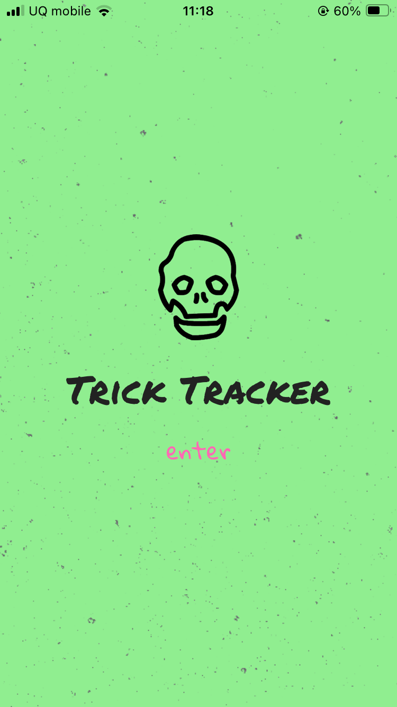
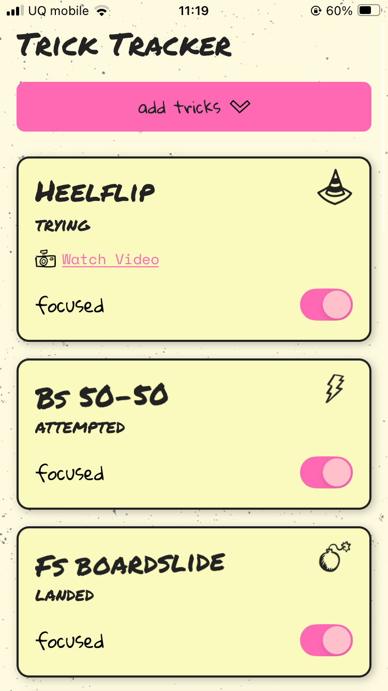
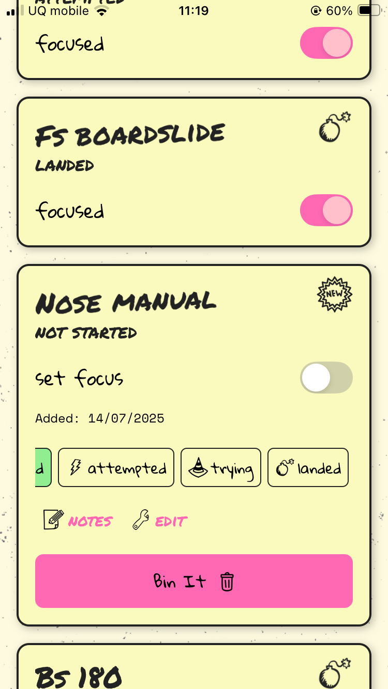
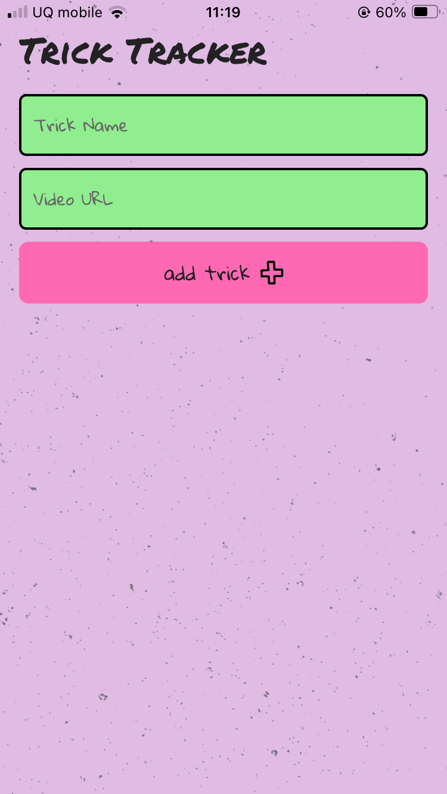

# Trick Tracker 🛹

A fun, visual mobile app to help skateboarders track the tricks they're learning, attempting, or have landed.
This app is simple to use, and has a fun DIY aesthetic.

## Live Demo

Scan with Expo Go or click to open:
[Open in Expo Go](https://expo.dev/accounts/dlong86/projects/trick-tracker/updates/5526df9d-eb19-4eb5-b427-8d793190486b)

## Features

- Add tricks with status: "Not started", "attempted", "trying", "landed", "on lock"
- Track progress visually with doodle, hand-drawn styled icons and text
- Expand trick cards for notes and settings
- Filter and sort
- Save data locally (persistent between sessions)

## Tech Stack

- React Native with Typescript
- AsyncStorage for persistent local data
- Hand drawn icons from FlatIcons
- Animated UI with React Native Reanimated and LayoutAnimation

## Installation

```bash
git clone https://github.com/DLong86/trick-tracker
cd trick-tracker
npm install
npx expo start
```

## 📸 Screenshots

   
 

## 🤝 Contributing

Contributions, issues, and feature requests are welcome.  
Feel free to fork the repo and submit a pull request.  
For major changes, please open an issue first to discuss what you’d like to change.

## 📄 License

This project is licensed under the MIT License. See the [LICENSE](LICENSE) file for details.
